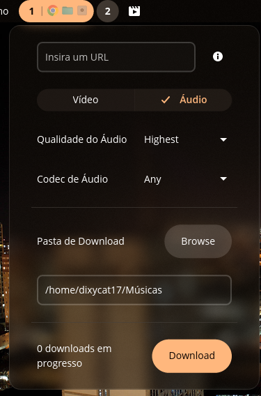

# COSMIC Applet yt-dlp

<p align="center">
  <a href="./README.md"><b>English</b></a> |
  <a href="./README.pt-BR.md"><b>Português (Brasil)</b></a> |
  <a href="./README.es.md"><b>Español</b></a>
</p>

<p align="center">
  A modern, feature-rich <b>yt-dlp GUI applet</b> built with Rust for the <b>COSMIC Desktop Environment</b>.
</p>

<p align="center">
  
</p>

---
  <a href="./README.imagens.md"><b>Imagens (Fotos do applet)</b></a>

## ✨ Features

- 🎨 **Native COSMIC Design & Frosted Glass Blur**: Seamlessly blends with the COSMIC desktop, matching your system theme and transparency settings.
- 🎬 **Video & Audio Downloads**: Quickly download videos (up to 1080p/4K) or extract audio streams (MP3, AAC, Opus, etc.).
- 📑 **Playlist Support**: Paste any playlist link and download entire playlists with per-track progress display (`Playlist 3/4 - Title`).
- ⚡ **Real-Time Download Stats**:
  - Live download speed (e.g. `2.23 Mb/s`)
  - Accurate progress bar and percentage (`31%`)
  - Estimated time remaining / ETA (`estimado: 1s`)
  - Downloaded size vs total size (`1.2 MB / 3.8 MB`)
- 📁 **Custom Download Folder**: Choose default folders for video and audio with a native file picker.
- 🔔 **System Notifications**: Desktop alerts when downloads finish or if errors occur.

---

## 📦 Installation

### Pre-built Packages (.deb / .rpm)

Download the latest release for your architecture (`x86_64` or `arm64`) from the [Releases](https://github.com/felix-the-cat177/cosmic-applet-yt-dlp-dixycat/releases/latest) page.

#### Debian / Ubuntu / Pop!_OS:
```bash
sudo apt install ./cosmic-applet-yt-dlp-dixycat_*.deb
```

#### Fedora / openSUSE / RPM distros:
```bash
sudo rpm -i ./cosmic-applet-yt-dlp-dixycat-*.rpm
```

---

## 🛠️ Building from Source

### Dependencies
Ensure you have Rust, `just`, and `libxkbcommon-dev` installed:
```bash
sudo apt install -y rustc cargo just libxkbcommon-dev
```

### Build & Install
```bash
git clone https://github.com/felix-the-cat177/cosmic-applet-yt-dlp-dixycat.git
cd cosmic-applet-yt-dlp-dixycat

# Build release
just build-release

# Install locally
sudo just install
# or for user only:
just install-local
```

### Packaging Recipes
- `just build-deb` — Generate Debian `.deb` package
- `just build-rpm` — Generate RedHat `.rpm` package

---

## 📄 License

Distributed under the [GPL-3.0 License](./LICENSE).
