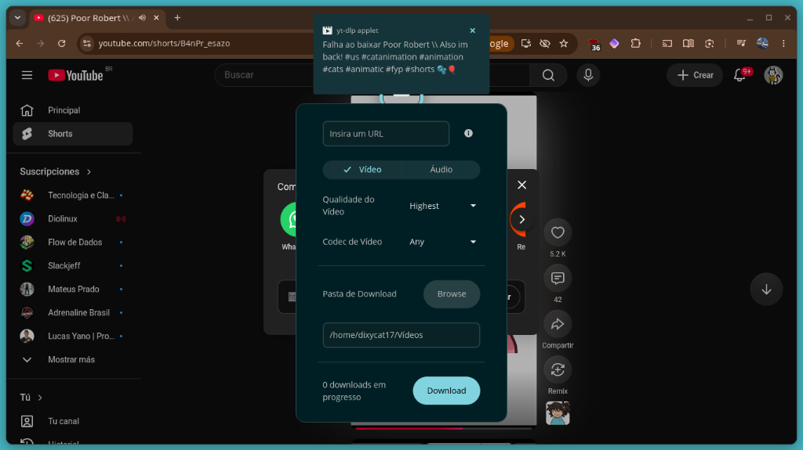

# COSMIC Applet yt-dlp

<p align="center">
  <a href="./README.md"><b>English</b></a> |
  <a href="./README.pt-BR.md"><b>Português (Brasil)</b></a> |
  <a href="./README.es.md"><b>Español</b></a>
</p>

<p align="center">
  Um applet moderno e completo com interface para o <b>yt-dlp</b> desenvolvido em Rust para o <b>COSMIC Desktop Environment</b>.
</p>

<p align="center">
  
</p>

---

## ✨ Recursos

- 🎨 **Design Nativo COSMIC & Efeito Vidro Fosco (Blur)**: Integração visual perfeita com o tema do sistema, respeitando as preferências de transparência e blur do COSMIC.
- 🎬 **Downloads de Vídeo e Áudio**: Baixe vídeos (Highest, 1080p, 720p, 480p) ou extraia faixas de áudio com seleção de qualidade e codec (Opus, AAC, MP3, Any).
- 📑 **Suporte Completo a Playlists**: Baixe playlists inteiras com indicação individual de faixa e progresso em tempo real (`Playlist 3/4 - Título`).
- ⚡ **Estatísticas de Download em Tempo Real**:
  - Velocidade atual da rede (ex: `2.23 Mb/s`)
  - Barra de progresso linear com porcentagem (`31%`)
  - Tempo restante estimado / ETA (`estimado: 1s`)
  - Tamanho baixado vs tamanho total (`1.2 MB / 3.8 MB`)
- 📁 **Pasta de Download Personalizada**: Escolha pastas de destino para vídeos e músicas com o seletor nativo do sistema.
- 🔔 **Notificações do Sistema**: Avisos no desktop ao iniciar, concluir ou em caso de falha no download.

---

## 📦 Instalação

### Pacotes Prontos (.deb / .rpm)

Baixe a versão mais recente para a sua arquitetura (`x86_64` ou `arm64`) na página de [Releases](https://github.com/felix-the-cat177/cosmic-applet-yt-dlp-dixycat/releases/latest).

#### Debian / Ubuntu / Pop!_OS:
```bash
sudo apt install ./cosmic-applet-yt-dlp-dixycat_*.deb
```

#### Fedora / openSUSE / distribuições baseadas em RPM:
```bash
sudo rpm -i ./cosmic-applet-yt-dlp-dixycat-*.rpm
```

---

## 🛠️ Compilação a partir do Código-Fonte

### Dependências
Certifique-se de ter o Rust, `just` e `libxkbcommon-dev` instalados:
```bash
sudo apt install -y rustc cargo just libxkbcommon-dev
```

### Compilar e Instalar
```bash
git clone https://github.com/felix-the-cat177/cosmic-applet-yt-dlp-dixycat.git
cd cosmic-applet-yt-dlp-dixycat

# Compilar em modo release
just build-release

# Instalar no sistema
sudo just install
# ou apenas para o usuário atual:
just install-local
```

### Comandos de Empacotamento
- `just build-deb` — Gera o pacote Debian `.deb`
- `just build-rpm` — Gera o pacote RedHat `.rpm`

---

## 📄 Licença

Distribuído sob a licença [GPL-3.0](./LICENSE).
